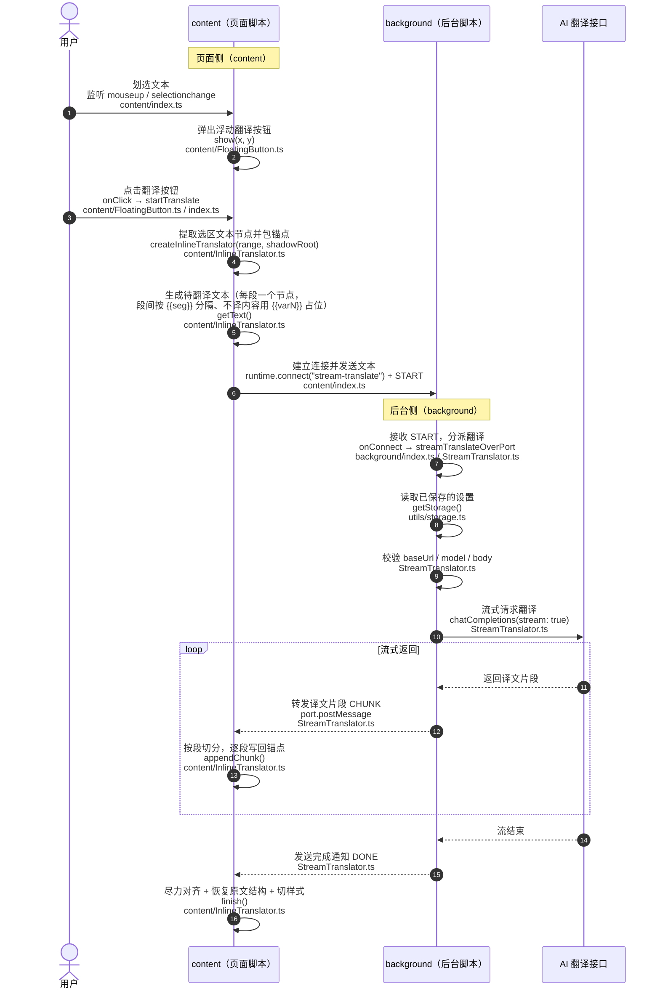

# 架构文档：划词翻译流程

> 本文档集中描述 content 端"划词 → 点击翻译 → 流式覆盖原文"的完整链路，以及它
> 与 background / options / 共享协议的关系。用于新人快速建立全局认知，避免在多个
> 文件间来回跳转。**协议部分的改动约定请以 AGENTS.md 的"最容易踩的坑"为准。**

## 1. 一句话概览

用户在网页上划词，content 端把**选中的每个文本节点当作一段**、用 `{{seg}}` 分隔、
不译内容（未选中部分 / pre/code）用 `{{varN}}` 占位符替代，拼成一段协议文本经长连接
端口发给 background，background 流式调用 LLM 后逐 chunk 回传，content 端再按段
「删除占位符」把译文写回对应的锚点 span，实现原地流式替换。

## 2. 完整调用链（时序图）

**回传方向**：`CHUNK` 逐 chunk 沿端口回到 `streamTranslate.ts` 的 `messageHandler`，
再触发 `onChunk` → `InlineTranslator.appendChunk` 写回。

## 3. 文件职责表

| 文件 | 职责 | 一句话 |
|---|---|---|
| `app/content/index.ts` | content 入口、事件编排、触发/打断会话 | 收敛"收集文本→发起流式→写回分流→收尾复位"，点击后流程的阅读入口 |
| `app/content/FloatingButton.ts` | 浮动按钮的 DOM/样式/点击回传 | 纯 UI，无业务逻辑 |
| `app/content/InlineTranslator.ts` | 文本节点收集、锚点建立、流式写回、收尾/回滚 | 协议文本的构造与 DOM 写回核心 |
| `app/utils/streamTranslate.ts` | 端口客户端（content/options 共用） | 统一管理端口生命周期，回调给消费方 |
| `app/background/index.ts` | background 入口、端口监听 | 收到 START 转发给 StreamTranslator |
| `app/background/StreamTranslator.ts` | 读配置、拼 prompt、流式调 LLM、回传 chunk | 真正的 LLM 请求端 |
| `app/utils/protocol.ts` | 段分隔/占位符/解析，content 与 options 共用 | 协议常量与解析函数唯一来源 |
| `app/types/messages.ts` | 端口消息类型（START/CHUNK/DONE/ERROR） | 四端消息契约 |
| `app/options/hooks/useTestTranslation.ts` | options 测试板块 | 复用 streamTranslate + protocol，模拟真实划词 |

## 4. 四阶段详解

### 阶段一：划词 → 显示浮动按钮
- `content/index.ts`：`handleMouseUp` → `getSelectedText()` 读选区文本。
- 有文字 → `showButton(x, y)` + `onClick(() => startTranslate(text))`。
- 按钮 DOM 全在 `FloatingButton.ts`（每次点击都 `show()` 重建，`onClick` 注册点击回调）。

### 阶段二：点击按钮 → 收集待翻译文本节点
- `startTranslate()` 取 `Range`，`createInlineTranslator(range, shadowRoot)`。
- `InlineTranslator.extractTextNodes()`：
  - `TreeWalker` 遍历选中区域文本节点，**每个文本节点 = 一段**；
  - 每节点包 `` 锚点（后续写回/恢复直接操作 span）；
  - **不译内容**（未选中前/后、`pre/code` 等 preserve 节点）→ 替换为 `{{varN}}` 占位符；
  - 段间用 `{{seg}}` 分隔（**不用换行**，段内允许模型自由换行而不破坏段数对齐）。
- `translator.getText()` 返回协议文本。

### 阶段三：发出 LLM 请求（端口通信）
- `startTranslate()` 内 `streamTranslate({ text, pageMeta, onChunk/onDone/onError/onDisconnect })`。
- `streamTranslate.ts`：`browser.runtime.connect("stream-translate")`，post `START`，监听 `CHUNK/DONE/ERROR`，统一管理端口生命周期（清理/超时/disconnect 兜底）。
- `background/index.ts`：`onConnect` 收到 `START` → `streamTranslateOverPort`。
- `StreamTranslator.ts`：读 storage 配置 → `buildSystemPrompt`（注入网页元数据 + 段对齐规则）→ `chatCompletions` 流式请求，逐 chunk `postMessage(CHUNK)`。

### 阶段四：流式写回原文
- background 逐 chunk 发 `CHUNK` → `streamTranslate.ts` → `onChunk` → `InlineTranslator.appendChunk`：
  - 累积 buffer，按 `{{seg}}` 拆段，`writeToSegment` **删除占位符后**写回对应 span 锚点（preserve 段保持原文）。
- 收到 `DONE` → `finish()`：flush 缓冲、尽力对齐段数、unwrap 锚点恢复 DOM、切 `llm-translated` class。
- `ERROR` / 异常断开 → `destroy()`：**回滚原文**、移除锚点与样式。

## 5. 协议与共享边界（改动必须两端同步）

| 协议 | 定义处 | 说明 |
|---|---|---|
| `SEGMENT_SEPARATOR` = `{{seg}}` | `utils/protocol.ts` | 段分隔符，content 构造 / InlineTranslator 写回 / options 解析共用 |
| 占位符 `{{varN}}` | `utils/protocol.ts` | 不译内容占位，模型照抄，写回时删除 |
| `stripIncompleteSegmentPrefix` | `utils/protocol.ts` | 剥离流式中"未完成的分隔符前缀"（`{{seg`/`{{se`/`{{s`/`{{`） |
| `extractTranslatedContent` | `utils/protocol.ts` | 删除占位符得到纯译文 |
| 端口消息协议 | `types/messages.ts` | START/CHUNK/DONE/ERROR，background+content+options 三端一致 |
| 端口名 `stream-translate` | `types/messages.ts` | 三端一致 |

> ⚠️ 改 prompt（`StreamTranslator.buildSystemPrompt`）或 `InlineTranslator.ts` 的分段构造 /
> `protocol.ts` 的解析，必须 content / background / options 三端同步，否则段数对齐会错位
> （详见 AGENTS.md"最容易踩的坑"）。

## 6. 阅读建议（给新人）

想理解"点击翻译按钮后发生了什么"，按这个顺序读：

1. `content/index.ts` —— 看交互入口与一次会话的完整编排；
2. **`InlineTranslator.ts`** —— 看协议文本如何构造、译文如何写回 DOM；
3. `utils/protocol.ts` + `types/messages.ts` —— 看协议常量与消息契约；
4. `background/StreamTranslator.ts` —— 看 prompt 构造与 LLM 调用。

想比对 options 测试板块如何复用它，看 `options/hooks/useTestTranslation.ts`。