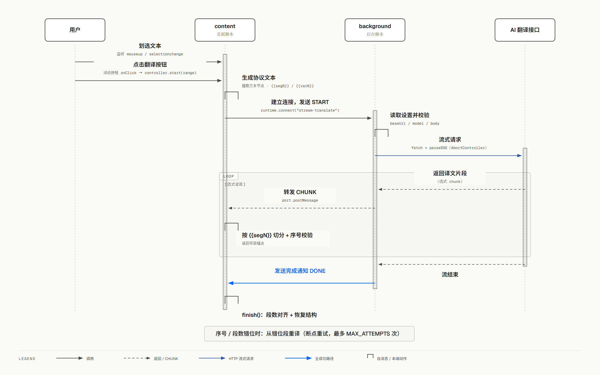

# 架构文档：划词翻译流程

> 本文档集中描述 content 端"划词 → 点击翻译 → 流式覆盖原文"的完整链路，以及它
> 与 background / 共享协议的关系。用于新人快速建立全局认知，避免在多个文件间来回
> 跳转。**协议部分的改动约定请以 AGENTS.md 的"最容易踩的坑"为准。**

## 1. 一句话概览

用户在网页上划词，content 端把**选中的每个文本节点当作一段**、每段后跟带序号的
`{{segN}}` 分隔标记（含最后一段，N 为绝对段序号）、不译内容（未选中部分 / pre/code）
用 `{{varN}}` 占位符替代，拼成一段协议文本经长连接端口发给 background，background
流式调用 LLM 后逐 chunk 回传，content 端再按 `{{segN}}` 的序号逐段「删除占位符」把
译文写回对应的锚点 span，实现原地流式替换。若模型发生拆/并段错位，还能**精确定位
错位段并从该段起重译（断点重试）**，而不是全文重译。

## 2. 完整调用链（时序图）

> 图源：`docs/diagrams/architecture-sequence.html`（diagram-design 重绘，需要调整时改 HTML 后重新截图）

**回传方向**：`CHUNK` 逐 chunk 沿端口回到 `streamTranslate.ts` 的 `messageHandler`，
再触发 `onChunk` → `InlineTranslator.appendChunk` 写回。

## 3. 文件职责表

| 文件 | 职责 | 一句话 |
|---|---|---|
| `app/content/index.ts` | content 入口、事件编排、触发/打断会话 | 收敛"事件 → 动作"声明式转发，点击后流程的阅读入口 |
| `app/content/TranslationController.ts` | 会话状态机 + 断点重试编排 | 一次会话生命周期（start/abort/dispose）与错位重试的编排核心 |
| `app/content/FloatingButton.ts` | 浮动按钮的 DOM/样式/点击回传 | 纯 UI，无业务逻辑 |
| `app/content/InlineTranslator.ts` | 文本节点收集、锚点建立、流式写回、收尾/回滚/断点重启 | 协议文本的构造与 DOM 写回核心 |
| `app/utils/streamTranslate.ts` | 端口客户端（content 端使用） | 统一管理端口生命周期，回调给消费方 |
| `app/utils/protocol.ts` | 段分隔/占位符/流式解析 | 协议常量与解析函数唯一来源 |
| `app/background/index.ts` | background 入口、端口监听 | 收到连接转发给 PortListener |
| `app/background/PortListener.ts` | 端口级生命周期（重复 START 打断、断开中止） | 端口级会话管理 |
| `app/background/StreamTranslator.ts` | 读配置、拼 prompt、流式调 LLM（可中止）、回传 chunk | 真正的 LLM 请求端 |
| `app/types/messages.ts` | 端口消息类型（START/CHUNK/DONE/ERROR） | 消息契约 |

## 4. 四阶段详解

### 阶段一：划词 → 显示浮动按钮
- `content/index.ts`：`handleMouseUp` → `controller.getSelectedText()` 读选区文本。
- 有文字 → `showButton(x, y)` + `onClick(() => controller.start(range))`。
- 按钮 DOM 全在 `FloatingButton.ts`（每次点击都 `show()` 重建，`onClick` 注册点击回调）。

### 阶段二：点击按钮 → 收集待翻译文本节点
- `TranslationController.start(range)` 保留 Range，`createInlineTranslator(range)`。
- `InlineTranslator.extractTextNodes()`：
  - `TreeWalker` 遍历选中区域文本节点，**每个文本节点 = 一段**（`pre/code` 等 preserve 块除外：**整块 = 一段**）；
  - 每节点包 `` 锚点（preserve 块包整个最外层元素），后续写回/恢复直接操作 span；
  - **不译内容**（未选中前/后、`pre/code` 等 preserve 块）→ 替换为 `{{varN}}` 占位符（preserve 块整体只占一个占位符）；
  - **每段后跟 `{{segN}}`**（N 为绝对段序号，含最后一段；不用换行，段内允许模型自由换行而不破坏段数对齐）。
- `translator.getText()` 用 `joinSegmentRows(protocolRows, 0)` 返回协议文本。

### 阶段三：发出 LLM 请求（端口通信）
- `TranslationController.runStream(text)` 内 `streamTranslate({ text, pageMeta, onChunk/onDone/onError/onDisconnect })`。
- `streamTranslate.ts`：`browser.runtime.connect("stream-translate")`，post `START`，监听 `CHUNK/DONE/ERROR`，统一管理端口生命周期（清理/超时/disconnect 兜底）。
- `background/index.ts`：`onConnect` 收到 `stream-translate` 端口 → `onStreamTranslatePort(port)`。
- `PortListener.ts`：收到 `START` 先打断同端口上一会话，再 `startStreamTranslation`；端口断开时 `abort()` 中止在途请求。
- `StreamTranslator.ts`：读 storage 配置 → `buildSystemPrompt`（注入网页元数据 + 段对齐规则）→ 原生 `fetch` + `parseSSE` 流式请求（持有 `AbortController`），逐 chunk `postMessage(CHUNK)`。

### 阶段四：流式写回原文 + 断点重试
- background 逐 chunk 发 `CHUNK` → `streamTranslate.ts` → `onChunk` → `InlineTranslator.appendChunk`：
  - `SegmentStreamParser.push` 累积 buffer，按 `{{segN}}` 拆段，对每个完整段回调 `onSegment(segment, segmentNumber)`；
  - **序号对齐检测**：第 `currentNodeIndex` 个输出段应结束于 `{{seg(currentNodeIndex+1)}}`，序号不符说明模型在之前发生了拆/并段错位 → 立即 `onMisalign(错位段)` 触发断点重试；
  - 序号正确 → `writeToSegment` **删除占位符后**写回对应 span 锚点（preserve 段保持原文）。
- 收到 `DONE` → `finish()`：flush 缓冲、段数兜底（模型输出段数 < 期望段数即视为末尾吞段，返回错位段重试）、unwrap 锚点恢复 DOM（译文直接替换原文，无样式标记）。
- `ERROR` / 异常断开 → `destroy()`：**回滚原文**、移除锚点与样式。

**断点重试（错位恢复）**：
- `TranslationController.handleMisalign(fromSegment)`：达到 `MAX_ATTEMPTS`（默认 5）则回滚原文放弃；否则 `abort` 旧流 + `runStream(translator.restart(fromSegment))`。
- `InlineTranslator.restart(fromSegment)`：恢复错位段及之后锚点的原文（前半段已写回的译文保留不动）、重建解析器、按**绝对序号**重新拼接"从错位段起的协议子文本"返回。
- 为什么能精确定位错位段：`{{segN}}` 序号是**每段都有的地标**，长文多段纯文本之间即使没有 `{{varN}}` 占位符，也能靠序号判断"从哪一段开始错位"，从而只重译后半段、节省 token 并随错位段前进而收敛。

## 5. 协议与共享边界（改动必须两端同步）

| 协议 | 定义处 | 说明 |
|---|---|---|
| `segmentSeparator(n)` → `{{segN}}` | `utils/protocol.ts` | 段分隔标记，N 为绝对段序号（1 起），每段含最后一段都带 |
| `joinSegmentRows(rows, startIndex)` | `utils/protocol.ts` | 按绝对序号拼接协议行（初始 startIndex=0；断点重试 startIndex=fromSegment） |
| 占位符 `{{varN}}` | `utils/protocol.ts` | 不译内容占位，模型照抄，写回时删除 |
| `stripIncompleteSegmentPrefix` | `utils/protocol.ts` | 剥离流式中未完成的协议标记前缀（`{{segN}}` 与 `{{varN}}` 的任意截断前缀，如 `{{seg`/`{{s`/`{{va`/`{{var1`） |
| `SegmentStreamParser` | `utils/protocol.ts` | 共享段流解析器（`{{segN}}` 拆分 / 空段对齐 / 前缀剥离），`onSegment` 回调带序号 |
| `extractTranslatedContent` | `utils/protocol.ts` | 删除占位符得到纯译文 |
| 端口消息协议 | `types/messages.ts` | START/CHUNK/DONE/ERROR，content + background 两端一致 |
| 端口名 `stream-translate` | `types/messages.ts` | 两端一致 |

> ⚠️ 改 prompt（`StreamTranslator.buildSystemPrompt`）或 `InlineTranslator.ts` 的分段构造 /
> `protocol.ts` 的解析，必须 content / background 两端同步，否则段数对齐会错位
> （详见 AGENTS.md"最容易踩的坑"）。

## 6. 阅读建议（给新人）

想理解"点击翻译按钮后发生了什么"，按这个顺序读：

1. `content/index.ts` —— 看交互入口与事件转发；
2. **`content/TranslationController.ts`** —— 看一次会话的编排与断点重试；
3. **`InlineTranslator.ts`** —— 看协议文本如何构造、译文如何写回 DOM、错位如何重启；
4. `utils/protocol.ts` + `types/messages.ts` —— 看协议常量与消息契约；
5. `background/StreamTranslator.ts` —— 看 prompt 构造与 LLM 调用。
