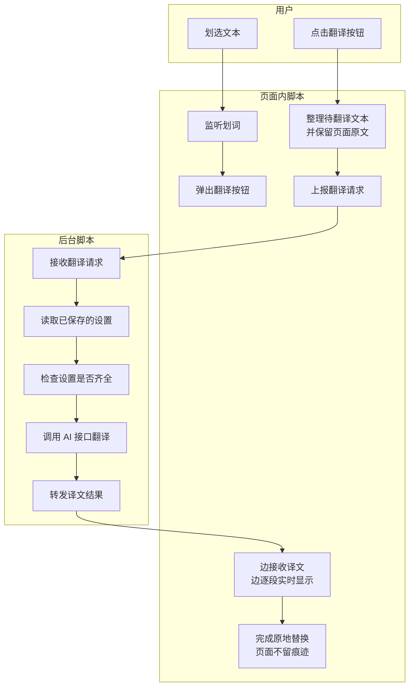
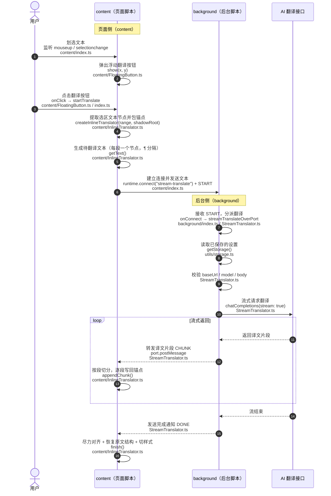
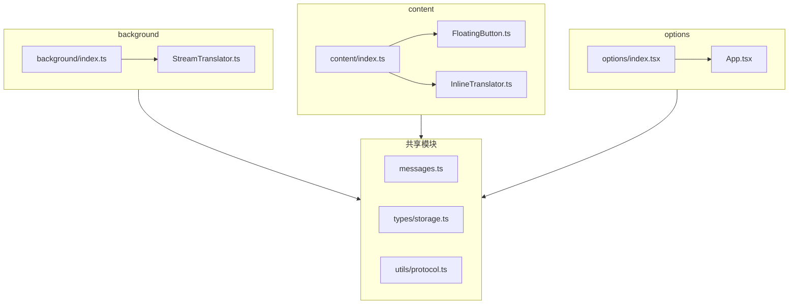

# LLM Streaming Translator 业务流程图（Mermaid）

> 使用 Mermaid 语法描述核心业务「划词 → 翻译 → 原地替换」的协作流程。
> 在支持 Mermaid 的编辑器或 GitHub/GitLab 中可直接渲染。
> 技术与协议细节（行对齐协议、端口消息、存储 schema、权限、入口文件）见 AGENTS.md「架构要点 / 最容易踩的坑」。

---

## 1. 整体业务流程图（面向项目干系人）

---

## 2. 划词翻译时序图（content / background 分工）

---

## 3. 组件依赖关系图

