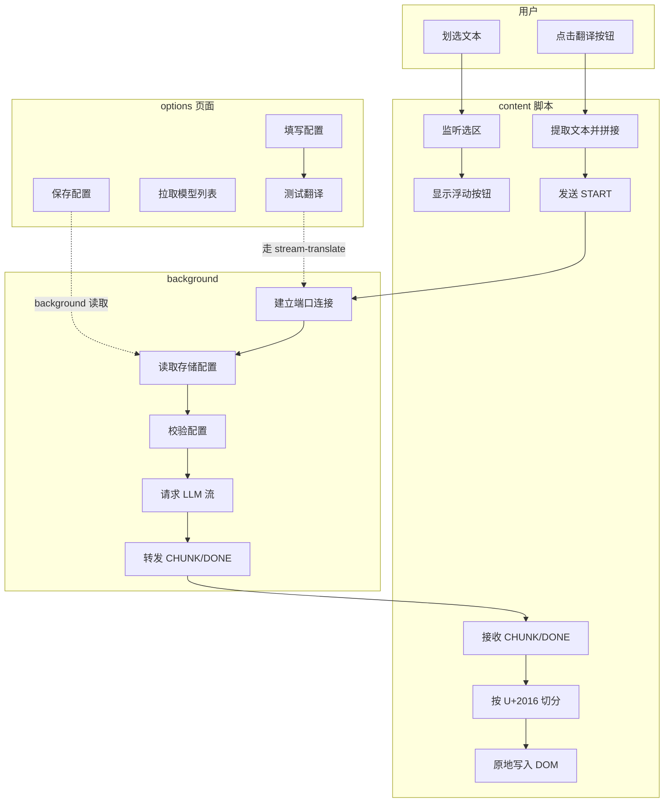
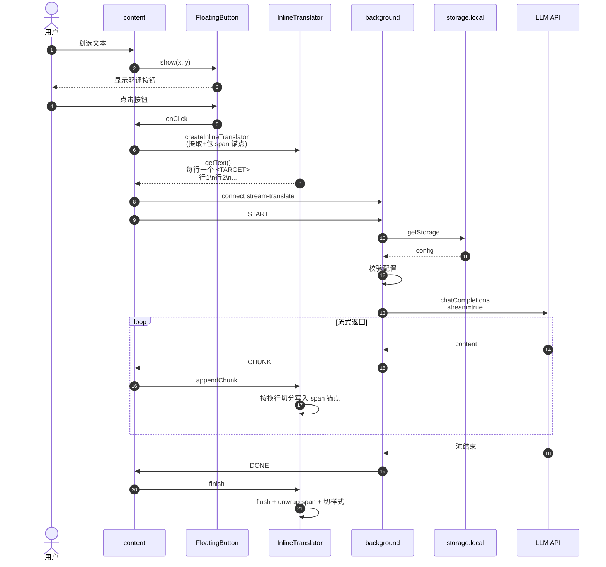
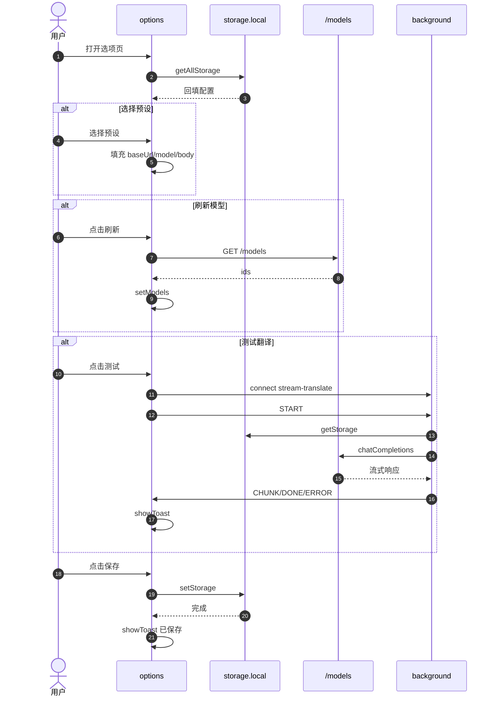
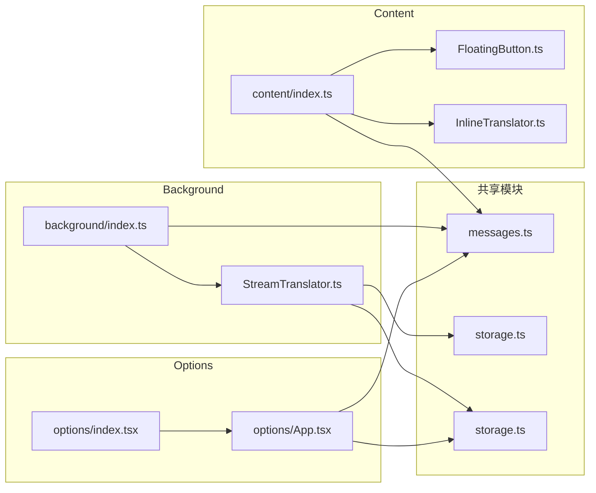

# LLM Streaming Translator 业务流程图（Mermaid）

> 使用 Mermaid 语法描述 options / content / background 三端如何协作完成「划词 → 翻译 → 原地替换」。
> 在支持 Mermaid 的编辑器或 GitHub/GitLab 中可直接渲染。

---

## 1. 整体业务流程图

---

## 2. 划词翻译时序图

---

## 3. options 页面配置与测试流程

---

## 4. 关键协作说明

### 4.1 分段对齐协议

- **content**：`InlineTranslator.ts` 两阶段提取——先收集选区内每个 `Text` 节点的选中范围（不碰 DOM，避免 live `TreeWalker` 漂移），再统一用 `splitText()` 拆出选中部分并包 `` 锚点（纯定位用、无视觉、不影响布局）。
- **发送文本**：**每行一个 `<TARGET>`**，行 = 节点完整文本（上下文补全），选中部分用 `<TARGET>...</TARGET>` 包裹；无需翻译的节点（`pre/code/kbd/samp/var` 内）**不占行**，内容紧跟上一个 `<TARGET>` 行尾作上下文。
- **background**：系统提示要求 LLM 输出**与输入相同行数**（每行一个译文、按行对齐），每行只输出对应 `<TARGET>` 的译文（不带标签、不带上下文）。
- **content 写回**：收到 `CHUNK` 按换行切分，译文写入对应锚点（`span.textContent`）；**非选中部分 DOM 全程不动**。
- **unwrap 恢复**：翻译成功时 `span.replaceWith(译文文本)` 恢复原始 DOM 结构，`llm-translated` class 加在父元素；页面结构不留残渣。
- **行数校验（容错）**：`finish()` 时若已写入行数 ≠ 锚点数（LLM 未遵守行数协议），**恢复原文**（unwrap 回选中部分原文）并仅移除 `llm-translating` class——防止错位写回破坏页面。

> ⚠️ 修改 prompt 或 `InlineTranslator.ts` 的分段/标记逻辑必须两端同步，否则译文错位。

### 4.2 端口消息协议

定义见 `app/types/messages.ts`。当前 content 端实际只关心四条：

| 方向 | 类型 | 说明 |
|---|---|---|
| content → background | `START` | 发起翻译 |
| background → content | `CHUNK` | 译文片段 |
| background → content | `DONE` | 流结束 |
| background → content | `ERROR` | 翻译失败 |

> `REASONING` 和 `USAGE` 在原地替换模式下无消费，可考虑从协议中移除或仅保留扩展点。

### 4.3 存储与权限

- **存储**：`browser.storage.local` 只被 **background** 读取；content 只发文本。
- **Schema**：`{ baseUrl, model, apiKey, body, targetLang }`（见 `app/types/storage.ts`）。
- **权限**：manifest 仅声明 `activeTab + storage`；LLM 端点通过 `optional_host_permissions`（http/https）授权访问。

### 4.4 入口文件

| 入口 | 文件 | 职责 |
|---|---|---|
| content | `app/content/index.ts` | 监听划词、显示按钮、发起翻译、原地替换 |
| background | `app/background/index.ts` | 维护端口连接、调度翻译器 |
| options | `app/options/index.tsx` | 配置界面、测试、导入导出 |

---

## 5. 组件依赖关系图

