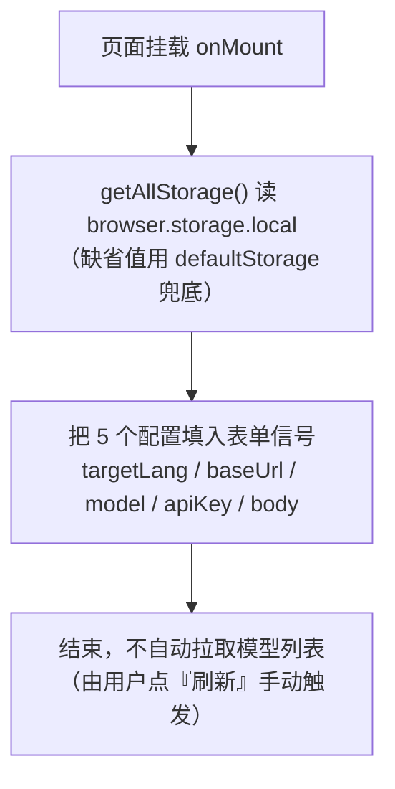
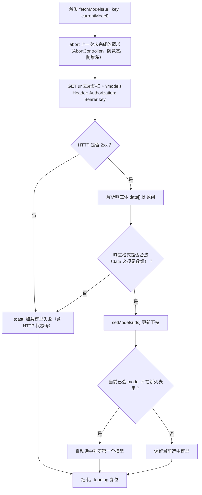
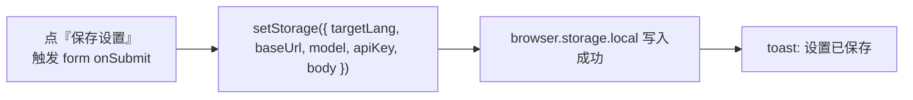
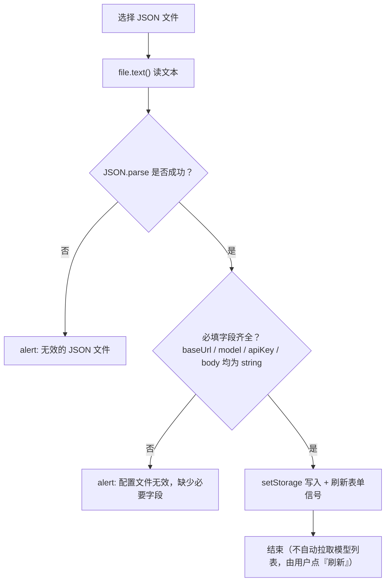
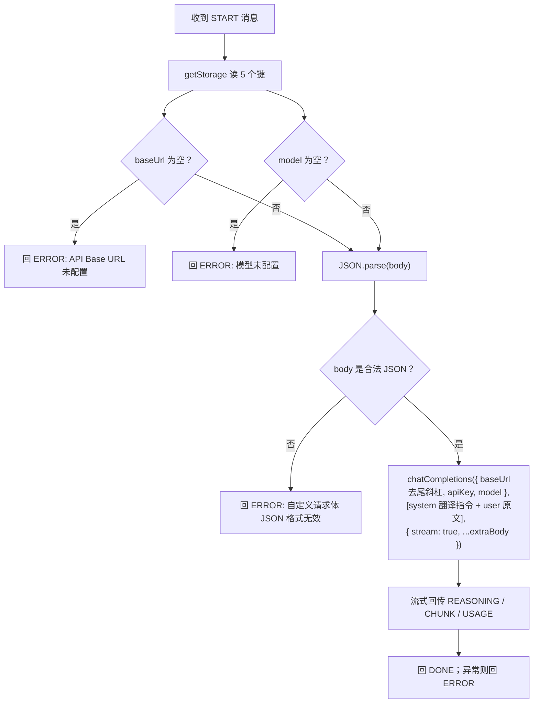

# Options 页面：翻译模型配置

> 对应代码：`app/options/App.tsx`、`app/options/index.tsx`、`app/utils/storage.ts`、`app/types/storage.ts`、`app/background/StreamTranslator.ts`

本页是扩展的**设置页**（点击工具栏图标会打开它，见 `app/background/index.ts` 的 `action.onClicked`），负责让用户配置"用哪个 LLM 端点 + 哪个模型"来翻译。

---

## 1. 配置项一览（表单字段 → storage 键）

所有配置保存在 `browser.storage.local`，schema 定义在 `app/types/storage.ts`，读写统一走 `app/utils/storage.ts`。

| 表单字段 | storage 键 | 说明 |
|---|---|---|
| 目标语言 | `targetLang` | 任意语言名（如"简体中文"），拼进 system prompt 指导翻译方向 |
| API Base URL | `baseUrl` | OpenAI 兼容端点，如 `https://api.deepseek.com` |
| API Key | `apiKey` | 仅发给上方配置的端点，存本地扩展存储 |
| 模型 | `model` | 可**手动输入**；点"刷新"会从 `{baseUrl}/models` 拉取列表供选择（自定义 Combobox 下拉组件） |
| 自定义请求体 | `body` | 一段 JSON 字符串，运行时会**合并进** `/chat/completions` 请求体 |

默认值（`defaultStorage`）：`baseUrl=https://api.deepseek.com`、`model=deepseek-chat`、`apiKey=""`、`body=""`、`targetLang="Chinese"`。

---

## 2. 预设（PRESETS）

代码顶部 `PRESETS` 常量内置了 4 个常用服务商，选择后**只填充表单、不自动保存**，仍需点"保存设置"：

| 预设名 | baseUrl | model | body 附带 |
|---|---|---|---|
| DeepSeek | `https://api.deepseek.com` | `deepseek-v4-flash` | `{"thinking":{"type":"disabled"}}` |
| OpenRouter | `https://openrouter.ai/api/v1` | `~openai/gpt-mini-latest` | `{"reasoning_effort":"minimal"}` |
| Google AI Studio | `https://generativelanguage.googleapis.com/v1beta/openai` | `models/gemma-4-31b-it` | `{"reasoning_effort":"minimal"}` |
| llama.cpp | `http://127.0.0.1:11434/v1` | 空 | `{"chat_template_kwargs":{"enable_thinking":false}}` |

> 说明：预设里 `body` 多为"关闭/降低思考（thinking/reasoning）"，因为翻译任务不需要长思考，能省 token 加快流式输出。

---

## 3. 页面初始化流程



---

## 4. 模型列表拉取（fetchModels）

模型下拉（Combobox 组件）的候选列表来自 `GET {baseUrl}/models`（OpenAI 兼容接口），请求头带 `Authorization: Bearer <apiKey>`。

触发时机：**仅点"刷新"按钮**（要求 baseUrl 与 apiKey 非空）。页面挂载、导入配置后均**不会**自动拉取，避免启动页面就发请求。



界面细节：模型字段是**自定义 Combobox 组件**（`app/components/Combobox/`）——既能从拉取结果中点选，也能**直接手动输入**（适配没有 `/models` 接口的供应商）。选择"预设"时会 `setModels([])` 清空旧列表，等待用户手动刷新；`modelOptions` memo 保证：即使当前 `model` 不在拉取结果里，也会把它保留在候选项中。

> **Combobox 交互方式**：点输入框**右侧箭头**或**聚焦输入框**即展开全部候选；输入关键字实时过滤（大小写不敏感的子串匹配）；键盘 `↑/↓` 移动高亮、`Enter` 选中、`Escape` 关闭；点击页面其他处自动收起。手动输入的值即使不在候选里也允许。
>
> 为什么不用原生 `<input list>` + `<datalist>`：datalist 下拉是浏览器私有实现，无统一外观且无法用 JS 编程展开，Chrome/Edge/Firefox 呼出方式不一致，所以改为自绘浮层列表。

---

## 5. 保存 / 测试翻译 / 导入导出

### 5.1 保存设置



### 5.2 测试翻译（跨页面 → background 长连接）

点"测试翻译"会用一段固定文本 `"The quick brown fox jumps over the lazy dog"` 走一遍真实翻译链路，验证配置可用。

```mermaid
sequenceDiagram
    participant Opt as Options 页面
    participant BG as Background<br/>(stream-translate 端口)
    participant LLM as LLM 端点

    Note over Opt: 前置校验：baseUrl、model 非空，否则 toast 报错
    Opt->>BG: browser.runtime.connect({ name: "stream-translate" })
    Note over Opt: 启动 30 秒超时定时器
    Opt->>BG: postMessage({ type: "START", text: 固定测试文本 })
    Note over BG: getStorage 读取【已保存的】配置<br/>（注意：不是表单里未保存的值！）
    BG-->>BG: 校验 baseUrl/model 非空<br/>JSON.parse(body)，失败回 ERROR
    BG->>LLM: chatCompletions(stream: true, ...extraBody)
    LLM-->>BG: 流式返回 reasoning / content / usage
    BG-->>Opt: REASONING / CHUNK / USAGE
    BG-->>Opt: DONE（成功）或 ERROR（失败）
    alt 30 秒内未收到 DONE/ERROR
        Opt-->>Opt: toast「测试翻译超时」，断开端口
    end
    Opt-->>Opt: 汇总 CHUNK 后 toast 显示翻译结果 / 失败原因
```

**重要坑（新人必读）**：测试翻译走的是 background 从 `browser.storage.local` 读到的**已保存配置**，不是当前表单里未保存的输入。想测试刚改的配置，必须先点"保存设置"。

### 5.3 导出配置

`getAllStorage()` 取全量配置 → 序列化成 JSON → 触发下载，文件名 `llm-translate-config-YYYY-MM-DD.json`。导出的文件**包含 API Key**，保存时 toast 会提示"妥善保存勿分享"。

### 5.4 导入配置



> 导入的 `targetLang` 缺失时兜底为 `"简体中文"`（`handleFileChange` 中的三元判断）。

---

## 6. 配置如何被消费（background 侧）

真实翻译时（划词翻译或测试翻译），`app/background/StreamTranslator.ts` 的 `streamTranslateOverPort` 按以下顺序使用配置：



要点：

- **body 合并规则**：`{ stream: true, ...extraBody }` —— 自定义字段会展开覆盖默认项。**不要**在 body 里写 `stream: false`，否则会关掉流式翻译。
- **targetLang 的用途**：拼进 system prompt（`Translate the user's text into ${targetLang}`），同时 prompt 里内置了 `‖`（U+2016）分段对齐协议，供划词翻译的多段文本对齐用。
- **权限模型**：manifest 只有 `activeTab` + `storage`，通过 `optional_host_permissions`（http/https）访问任意 LLM 端点，因此换新的 API 域名无需改 manifest。

---

## 7. 易踩的坑汇总

1. **测试翻译用的是已保存配置**，改完表单不点保存就点测试，测的是旧配置（见 5.2）。
2. **body 必须是合法 JSON**：保存时页面不校验，真正发起翻译时 background 才 `JSON.parse`，失败会直接报"自定义请求体 JSON 格式无效"。
3. **body 会覆盖 `stream`**：不要在里面写 `stream` 字段。
4. **预设不自动保存**：选完预设必须点"保存设置"。
5. **模型列表依赖 `/models` 端点**：自建服务（如 llama.cpp）可能不提供 `/models` 接口；此时列表拉取会失败，但模型字段支持**手动输入**，可绕过该接口直接使用（这正是模型改为组合框的原因）。
6. **导出文件含 API Key**：作为备份文件请勿外传。
7. **fetchModels 有竞态保护**：连续触发（如快速点刷新）时旧请求会被 `AbortController.abort()` 丢弃，`AbortError` 不弹 toast（代码里显式 `return`）。

---

## 8. 相关文件索引

| 文件 | 职责 |
|---|---|
| `app/options/App.tsx` | 设置页全部逻辑（表单、预设、拉模型、测试、导入导出） |
| `app/components/Combobox/Combobox.tsx` | 可输入可下拉的模型选择组件（点箭头/聚焦展开、输入过滤、键盘导航） |
| `app/options/index.tsx` | 入口：渲染 `App` |
| `app/types/storage.ts` | storage schema + 默认值 |
| `app/utils/storage.ts` | `getStorage` / `setStorage` / `getAllStorage` 封装 |
| `app/types/messages.ts` | 端口消息类型（START/CHUNK/REASONING/USAGE/DONE/ERROR） |
| `app/background/index.ts` | 接收 `stream-translate` 端口连接 |
| `app/background/StreamTranslator.ts` | 读配置、组装请求、流式回传 |
